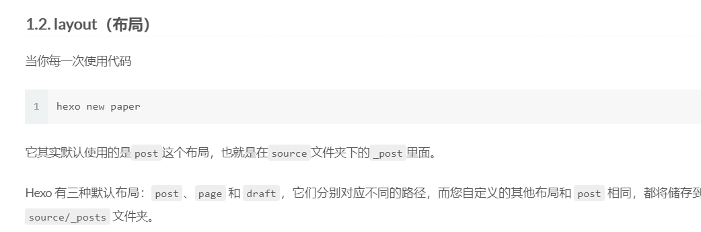

----

>  让我们看看能不能展示图片


- 同名文件夹中的图片引用可以直接使用图片名即可引用图片


- 使用远程文件


- 使用相对路径是引用不到图片的



***相关链接***

- [Hexo 引用本地图片以及引用本地任意位置图片的一点思路](https://leay.net/2019/12/25/hexo/)
- [Hexo博客新建文章并发布](https://www.jianshu.com/p/cd623d82c00a)


#### 使用Hexo 如何初始化

1. 初始化内容
   - 分类
   - 标签
   - 关于我
   - 等等
2. 如何在文章中配置分类、标签等信息


***相关链接***

- [Hexo使用攻略-添加分类及标签](https://linlif.github.io/2017/05/27/Hexo%E4%BD%BF%E7%94%A8%E6%94%BB%E7%95%A5-%E6%B7%BB%E5%8A%A0%E5%88%86%E7%B1%BB%E5%8F%8A%E6%A0%87%E7%AD%BE/)
- [配置](https://github.com/blinkfox/hexo-theme-matery/blob/develop/README_CN.md#%E9%85%8D%E7%BD%AE)
- [Hexo使用攻略：（四）Hexo的分类和标签设置](https://ijiaober.github.io/2014/08/05/hexo/hexo-04/)
- [hexo史上最全搭建教程](https://blog.csdn.net/sinat_37781304/article/details/82729029)
- [hexo 创建文章、标签、分类](https://blog.csdn.net/qq_32337109/article/details/78755662)
- [hexo博客front-matter格式](https://blog.csdn.net/qq_38747027/article/details/107967518)

```yaml
---
title: CentOS7下Tomcat启动慢的原因及解决方案
date: 2017-12-02 21:01:24
comments: true #是否可评论
toc: true #是否显示文章目录
categories:  #分类
    - 云服务器
tags:   #标签
    - centOS
    - tomcat
---

---
title: 标题
date: 2020-02-29 16:00:00
summary: # 文章摘要
toc: true
mathjax: true
top: true
cover: true
abbrlink: 213245 # 自己可随意设置
img: 'https://img-blog.csdnimg.cn/20200309120551356.png' # 设置文章背景图，设置为外链图片，访问快
tags:
  - 算法
  - 计算机知识
categories:
  - 算法
author: # 设置文章作者
password: # 设置密码（yml中开启相应功能）
coverImg: # 轮播图片
---


---
title: typora-vue-theme主题介绍
date: 2018-09-07 09:25:00
author: 赵奇
img: /source/images/xxx.jpg
top: true
cover: true
coverImg: /images/1.jpg
password: 8d969eef6ecad3c29a3a629280e686cf0c3f5d5a86aff3ca12020c923adc6c92
toc: false
mathjax: false
summary: 这是你自定义的文章摘要内容，如果这个属性有值，文章卡片摘要就显示这段文字，否则程序会自动截取文章的部分内容作为摘要
categories: Markdown
tags:
  - Typora
  - Markdown
---


```


> npm的一些使用操作：

## npm 插件安装


### 查看插件

```shell
npm list
```

### 视频

```shell
npm install dplayer --save
npm install hexo-tag-dplayer
```

如何使用：

```shell

```

### 音乐

```shell
npm install aplayer --save
npm install hexo-tag-aplayer
```

如何使用：

```shell
{% aplayer "HUSH" "Lasse Lindh" "http://opj0cbfmf.bkt.clouddn.com/Part.3%20Lasse%20Lindh%20-%20Hush.mp3"  "http://opj0cbfmf.bkt.clouddn.com/hush.jpg" "autoplay=false" %}
```

### 推送

```shell
npm install hexo-deployer-git --save
```

### 站点地图

```shell
npm install hexo-generator-sitemap --save
npm install hexo-generator-baidu-sitemap --save
```

### gulp压缩

```shell
npm install --global gulp-cli
npm install --save-dev gulp
npm i gulp gulp-clean-css gulp-htmlclean gulp-htmlmin gulp-imagemin gulp-uglify -S
npm install --save-dev gulp del
npm install --save-dev run-sequence
npm install gulp-minify-css --save-dev
```

### 站内搜索

```shell
npm install hexo-generator-search --save
```

### 百度主动提交

```shell
npm install hexo-baidu-url-submit --save
```

### 卸载

```shell
npm uninstall <你的插件名>
```


***相关链接***

- [卸载 hexo 插件](https://www.dazhuanlan.com/2019/10/12/5da110cdd9a7b/)


#### 好看的主题以及相关地址：

- [hexo-theme-matery主题](https://github.com/blinkfox/hexo-theme-matery)
- [hexo-matery-modified](https://github.com/godweiyang/hexo-matery-modified)
- [hexo-theme-yilia-plus](https://github.com/JoeyBling/hexo-theme-yilia-plus)


#### 一些好的文章：

- [超详细Hexo+Github博客搭建小白教程](https://zhuanlan.zhihu.com/p/35668237)
- [hexo中文官网](https://hexo.io/zh-cn/docs/configuration)
- [Hexo 博客从搭建部署到SEO优化等详细教程](https://www.jianshu.com/p/efaf72aab32e)
